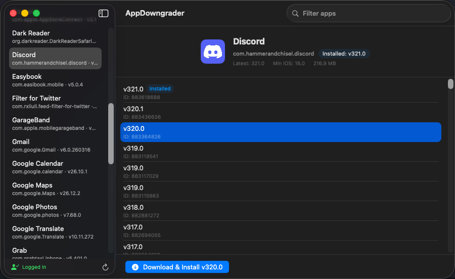

# AppDowngrader

A macOS app for downgrading iOS apps to older versions. It provides a GUI for browsing installed apps on your iOS device, viewing available historical versions, and installing any previous version.

[](https://www.youtube.com/watch?v=ZYa1Teq-5kI)

## Features

- Browse installed apps on connected iOS devices
- View all available historical versions for each app
- Download and install any previous version with one click
- Apple ID authentication with 2FA support
- Bundled tools (ipatool + go-ios) — no manual dependency installation

## Requirements

- macOS 14.0+
- An iOS device connected via USB
- An Apple ID (for downloading apps from the App Store)

## Install

Download the latest `.dmg` from [Releases](https://github.com/rxliuli/AppDowngrader/releases), open it, and drag AppDowngrader to Applications.

## Build from Source

```bash
# Run in development
swift run

# Build release .app + signed DMG (requires Developer ID certificate)
bash scripts/package.sh
```

Or open `AppDowngrader.xcodeproj` in Xcode for Archive and notarization.

## Limitations

- Some apps may fail to list versions due to Apple API restrictions
- Paid apps require a prior purchase on the same Apple ID
- Apple may change or restrict the APIs this tool depends on

## Support

If you find this tool useful, consider [sponsoring me on GitHub](https://github.com/sponsors/rxliuli).

## License

MIT
